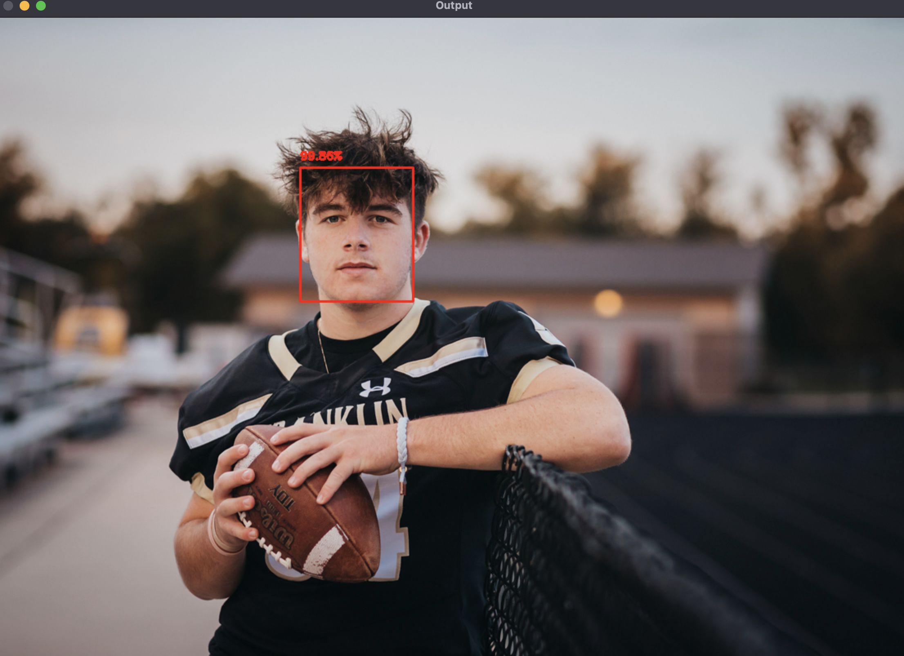

# Deep Learning Face Detection 🎯

Real-time face detection powered by OpenCV's DNN module and a Caffe-based model. This system efficiently detects faces in images using deep learning techniques with high accuracy.

## 🌟 Features

- Face detection using Deep Neural Networks
- Support for multiple face detection in a single image
- Confidence score display for each detection
- Bounding box visualization
- Easy-to-use command line interface

## 🛠️ Prerequisites

Before running the project, ensure you have:

- Python 3.x installed
- Pip package manager

### Install required packages:

```bash
pip install opencv-python numpy
```

## 📦 Installation

1. Clone the Repository:

```bash
git clone https://github.com/Amussse7/FaceScope.git
cd FaceScope
```

2. Download the required model files:

```bash
python3 download_model.py
```

### This will download:

- deploy.prototxt.txt - Model architecture
- res10_300x300_ssd_iter_140000.caffemodel - Pre-trained weights

## 🚀 Usage

Basic command:

```bash
python3 detect_faces.py -i path/to/image.jpg -p deploy.prototxt.txt -m res10_300x300_ssd_iter_140000.caffemodel
```

Command Line Arguments

| Argument       | Description                 | Required |
| :------------- | :-------------------------- | :------- |
| -i, --image    | Path to input image         | Yes      |
| -p, --prototxt | Path to Caffe prototxt file | Yes      |
| -m, --model    | Path to pre-trained model   | Yes      |
| -m, --model    | Detection confidence        | No       |

### Example

```bash
python3 detect_faces.py -i img-football-player.jpg -p deploy.prototxt.txt -m res10_300x300_ssd_iter_140000.caffemodel
```


## Results




